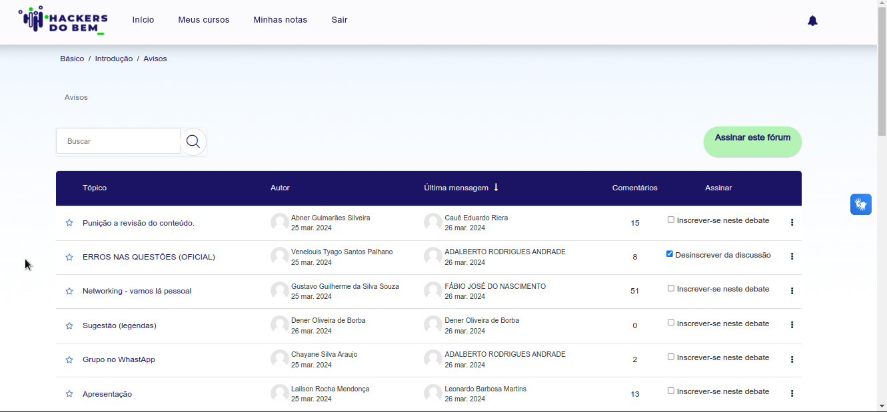
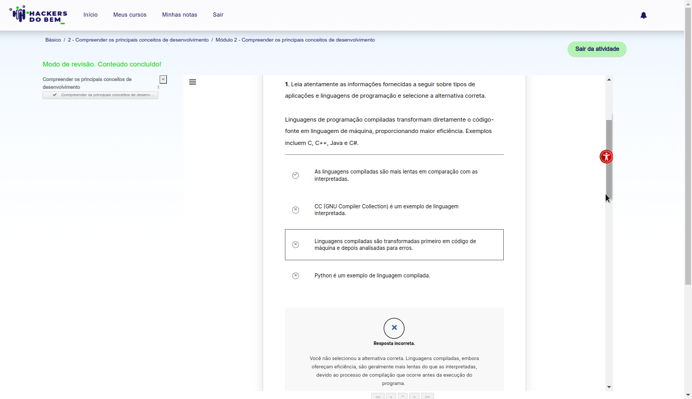

### Estes foram alguns erros que encontrei nas questões abaixo retiradas da plataforma Hackers do Bem, o mesmo conteúdo pode ser lido por alunos na plataforma através do endenreço: https://ava.hackersdobem.org.br/mod/forum/discuss.php?d=19 (último acesso em: 26 de março de 2024)

*Atualização: 26 de março 2024 às 21:51 - O fórum (avisos) da plataforma foi desabilitado para novas postagens.

## Erro 1:
Módulo 2 - Compreender os principais conceitos de desenvolvimento
Aula 2 – Principais tipos de aplicações
Praticando Questão 1: Leia atentamente as informações fornecidas a seguir sobre tipos de aplicações e linguagens de programação e selecione a alternativa correta.
Linguagens de programação compiladas transformam diretamente o código-fonte em linguagem de máquina, proporcionando maior eficiência. Exemplos incluem C, C++, Java e C#.

Item "correto" = As linguagens compiladas são mais lentas em comparação com as interpretadas. (será?)

Na verdade, é o contrário. As linguagens compiladas tendem a ser mais rápidas e mais eficientes em sua execução do que as linguagens interpretadas.

As linguagens compiladas são convertidas diretamente na máquina em um código de máquina que o processador pode executar. Como resultado, elas tendem a ser mais rápidas e mais eficientes em sua execução do que as linguagens interpretadas1. Elas também dão ao desenvolvedor mais controle sobre alguns aspectos do hardware, como o gerenciamento da memória e o uso da CPU1. Exemplos de linguagens compiladas puras são o C, o C++, o Erlang, o Haskell, o Rust e o Go.

As linguagens interpretadas passam por um programa linha por linha e executam cada comando1. Antigamente, eram significativamente mais lentas do que as linguagens compiladas. Porém, com o desenvolvimento da compilação just-in-time, essa distância vem diminuindo1. Exemplos de linguagens interpretadas comuns são o PHP, o Ruby, o Python e o JavaScript.

Portanto, se a velocidade de execução for uma prioridade, as linguagens compiladas podem ser uma escolha melhor. No entanto, as linguagens interpretadas oferecem vantagens, como a portabilidade e a flexibilidade, que podem ser mais adequadas para certos tipos de projetos.

## Erro 2:

Módulo 2 - Compreender os principais conceitos de desenvolvimento
Aula 2 – Principais tipos de aplicações
Praticando Questão 3: Leia as informações sobre compiladores e interpretadores e selecione a alternativa correta.
Compiladores transformam código-fonte em linguagem de máquina, identificam erros e geram arquivos executáveis. Por outro lado, interpretadores executam instruções uma a uma, sem converter todo o código de uma vez.

Item "correto" = Compiladores traduzem código-fonte, enquanto interpretadores executam instruções diretamente em linguagem de máquina. (será?)

Essa afirmação não está totalmente correta. Compiladores e interpretadores são ferramentas que facilitam a execução de programas escritos em linguagens de alto nível, mas o fazem de maneiras diferentes.

**Compiladores:**
* Traduzem o código-fonte de alto nível para linguagem de máquina antes da execução.
* O código-fonte é convertido em um arquivo executável que pode ser executado diretamente pelo sistema operacional.
* Exemplos de linguagens compiladas: C, C++, Java, Go.

**Interpretadores:**
* Leem e executam o código-fonte linha por linha durante a execução.
* Não geram um arquivo executável.
* Exemplos de linguagens interpretadas: Python, JavaScript, Ruby, PHP.

**Diferenças:**
* **Momento da tradução:** Compiladores traduzem o código antes da execução, enquanto intérpretes traduzem durante a execução.
* **Eficiência:** Programas compilados geralmente são mais rápidos que programas interpretados.
* **Portabilidade:** Programas compilados podem ser executados em diferentes plataformas sem modificação, enquanto programas interpretados podem precisar de um interpretador específico para cada plataforma.

**Em resumo:**
* Compiladores e interpretadores traduzem código-fonte para linguagem de máquina.
* Compiladores fazem isso antes da execução, enquanto intérpretes fazem durante a execução.
* Compiladores geralmente oferecem melhor desempenho, enquanto intérpretes oferecem melhor portabilidade.

**Exceções:**
* Existem linguagens que podem ser compiladas ou interpretadas, como C# e Visual Basic.
* Alguns interpretadores, como o PyPy, podem gerar código de máquina durante a execução, o que melhora o desempenho.

**Para escolher entre um compilador e um intérprete:**
* Considere a necessidade de velocidade, portabilidade e flexibilidade.
* Pesquise as características específicas da linguagem de programação que você deseja usar.

Compiladores traduzem código-fonte, enquanto interpretadores executam instruções diretamente em linguagem de máquina.

## Erro 3:
Aula 2 – Principais tipos de aplicações
Quiz Questão 3: Qual das seguintes afirmações descreve corretamente as aplicações dos tipos web, mobile, desktop, nuvem e IA?
- Aplicações desktop são instaladas localmente em um computador, enquanto aplicações de nuvem são acessadas através de um navegador da web.

Nenhuma das alternativas apresentadas descreve corretamente as aplicações dos tipos web, mobile, desktop, nuvem e IA. Aqui está uma descrição mais precisa:

- Aplicações web são acessadas através de um navegador da web e podem ser usadas em vários tipos de dispositivos, como desktops, laptops e dispositivos móveis.
- Aplicações mobile são desenvolvidas para serem usadas em dispositivos móveis, como smartphones e tablets. Elas podem ser desenvolvidas para vários sistemas operacionais, como iOS e Android.
- Aplicações desktop são instaladas localmente em um computador e são executadas no sistema operacional desse computador.
- Aplicações de nuvem são hospedadas em servidores remotos e são acessadas através da internet. Elas podem ser acessadas por meio de um navegador da web ou de um aplicativo instalado no dispositivo do usuário.
- Aplicações de IA (Inteligência Artificial) utilizam técnicas de aprendizado de máquina e outras formas de inteligência artificial para realizar tarefas complexas. Elas podem ser implementadas em qualquer um dos tipos de aplicações mencionados acima. Por exemplo, um aplicativo móvel pode usar IA para recomendar músicas com base nas preferências do usuário, ou um aplicativo de nuvem pode usar IA para analisar grandes volumes de dados.

Recursos adicionais para pesquisa:  
- Wikipedia - Aplicação web: https://pt.wikipedia.org/wiki/Aplica%C3%A7%C3%A3o_web
- Wikipedia - Aplicação móvel: https://pt.wikipedia.org/wiki/Aplica%C3%A7%C3%A3o_m%C3%B3vel
- Wikipedia - Software de computador: https://pt.wikipedia.org/wiki/Software_de_computador
- Wikipedia - Computação em nuvem: https://pt.wikipedia.org/wiki/Computa%C3%A7%C3%A3o_em_nuvem
- Wikipedia - Inteligência artificial: https://pt.wikipedia.org/wiki/Intelig%C3%AAncia_artificial

## Erro 4:
No quiz do módulo 3:
Questão 3: Considerando o que aprendeu sobre a Inteligência Artificial – IA, assinale abaixo qual das seguintes afirmações descreve corretamente a ameaça da IA para os ataques cibernéticos?

O primeiro ponto é que este módulo não aborda inteligência artificial.. Então temos as seguintes opções que são possivelmente corretas embora ambas abordem o uso da inteligência artificial de maneira oposta:

- A inteligência artificial pode ser usada em ataques cibernéticos para aumentar a escala, sofisticação e automação dos ataques, tornando-os mais difíceis de detectar e combater.
- A inteligência artificial pode ser usada em ataques cibernéticos para identificar e mitigar automaticamente ameaças, reduzindo a eficácia dos ataques.

O enunciado é meio duvidoso, ficaria mais claro se utilizasse as palavras "em favor de" ou "para o uso de", ou ainda "contra as "... "ameaças cibernéticas". Como a única palavra que está no enunciado é a palavra "para" entendemos de forma ainda que ambígua que seja "para potencializar" as ameaças. Essa questão parece até uma pegadinha, só que sem graça kk

## Erro 5:
No quiz do módulo 4:
questão 1: Considere o cenário: Uma empresa de consultoria em segurança cibernética está conduzindo uma avaliação de risco em uma organização financeira e durante a análise, eles identificaram o fator humano como o elo mais fraco da segurança, pois muitas violações de segurança ocorreram devido a erros ou comportamentos inadequados dos funcionários.
Qual das seguintes opções descreve corretamente uma situação que exemplifica o fator humano como o elo mais fraco da segurança?
Ambas as opções abaixo estão corretas e deveriam ser consideradas como tal:
- Um funcionário usando uma senha fraca para acessar o sistema de gestão de clientes da empresa.
- Um funcionário abrindo um anexo de e-mail de um remetente desconhecido, resultando na instalação de um programa de ransomware nos sistemas da empresa.

Explicações:
Ambas as opções fornecidas exemplificam o fator humano como o elo mais fraco da segurança, mas de maneiras distintas:

**Opção 1:**
* **Descrição:** Um funcionário utiliza uma senha fraca para acessar o sistema de gestão de clientes da empresa.
* **Risco:** Senhas fracas são facilmente adivinhadas por hackers, permitindo acesso não autorizado ao sistema e aos dados confidenciais dos clientes.
* **Exemplos de senhas fracas:** Senhas curtas, que utilizam apenas letras minúsculas, ou que contêm informações pessoais facilmente adivinhadas (como datas de nascimento ou nomes de familiares).
* **Recomendações:** Criar senhas fortes e complexas, com no mínimo 12 caracteres, combinando letras maiúsculas e minúsculas, números e símbolos especiais. Utilizar um gerenciador de senhas para armazenar e gerenciar as senhas de forma segura.

**Opção 2:**
* **Descrição:** Um funcionário abre um anexo de e-mail de um remetente desconhecido, instalando um programa de ransomware nos sistemas da empresa.
* **Risco:** A abertura de anexos maliciosos pode levar à instalação de malware, como ransomware, que criptografa os dados da empresa e exige pagamento de resgate para desbloqueá-los.
* **Exemplos de anexos maliciosos:** Anexos com extensões desconhecidas (.exe, .scr, .zip), arquivos com nomes genéricos ("Contrato.doc", "Fatura.pdf"), e-mails com erros gramaticais ou ortográficos.
* **Recomendações:** Evitar abrir anexos de e-mails de remetentes desconhecidos ou não confiáveis. Verificar a extensão do arquivo antes de abri-lo. Manter o antivírus e o software de segurança da empresa atualizados.

**Conclusão:**
Ambas as opções demonstram falhas no comportamento dos funcionários que podem comprometer a segurança da empresa. É crucial investir em treinamento e conscientização dos colaboradores sobre os riscos de segurança cibernética e as melhores práticas para proteger os dados da empresa.

**Outras medidas importantes:**
* Implementar políticas de segurança rígidas e bem definidas.
* Monitorar e auditar os sistemas da empresa regularmente.
* Realizar testes de penetração para identificar vulnerabilidades na segurança.
* Manter os sistemas e softwares da empresa atualizados com as últimas correções de segurança.

Investir na segurança da informação e na conscientização do fator humano é fundamental para proteger as empresas contra ataques cibernéticos e violações de dados.

## Erro 6:
Quiz 6 Questão 3: Qual das seguintes opções descreve corretamente um dos cinco controles destacados pelo TCU (Tribunal de Contas da União)?

CONTROLE 1: INVENTÁRIO E CONTROLE DE ATIVOS CORPORATIVOS
CONTROLE 2: INVENTÁRIO E CONTROLE DE ATIVOS DE SOFTWARE
CONTROLE 7 (3): GESTÃO CONTÍNUA DE VULNERABILIDADES
CONTROLE 14 (4): CONSCIENTIZAÇÃO SOBRE SEGURANÇA E TREINAMENTO DE COMPETÊNCIAS
CONTROLE 17 (5): GESTÃO DE RESPOSTAS A INCIDENTES

Fonte PDF do site do tcu: https://portal.tcu.gov.br/data/files/4D/E3/DF/81/8C0848102DFE0FF7F18818A8/__5%20Controles%20de%20seguranAa%20cibernAtica%20para%20ontem_final_web.pdf

Portanto a opção:
"Conscientização sobre segurança e treinamento: esse controle se concentra em criar uma cultura de segurança cibernética na organização por meio de programas de treinamento e conscientização para os funcionários."

Está correta! Veja o que diz mais o PDF sobre esse controle:

**Por que esse controle é crítico?**

No tripé da SegInfo, formado por tecnologia, processos e pessoas, estas representam, provavelmente, o principal ponto de fragilidade (no jargão da área, são “o elo mais fraco da corrente”). A título de exemplo, é bem mais fácil um invasor ter sucesso induzindo o usuário a clicar em um link ou abrir um anexo de e-mail e, com isso, instalar um software malicioso no próprio computador, do que explorando alguma vulnerabilidade de rede.

Ademais, os colaboradores, intencionalmente ou não, podem causar incidentes de segurança por meio de diversas outras ações, tais como o envio de e-mail com dados sensíveis para destinatário errado, a perda de equipamento/ dispositivo portátil – notebook, pendrive –, a utilização de senha fraca ou reutilização da mesma senha usada para autenticação em sítio público.

E ainda a justificativa de que a c é incorreta está ela mesmo equivocada:
"está incorreta, pois embora a conscientização e o treinamento sejam importantes, eles não são um dos cinco controles específicos destacados pelo TCU."

Pois de fato é sim um dos 5 controles específicos destacados pelo TCU, como podemos ver acima no próprio PDF!

Sobre a resposta correta ser: 
"Inventário e controle de ativos corporativos: esse controle envolve o monitoramento de todos os ativos de hardware e software da organização para garantir que estejam devidamente documentados e atualizados"

Está errada pois os ativos de software são monitorados pelo controle 2: INVENTÁRIO E CONTROLE DE ATIVOS DE SOFTWARE e não pelo controle 1!
